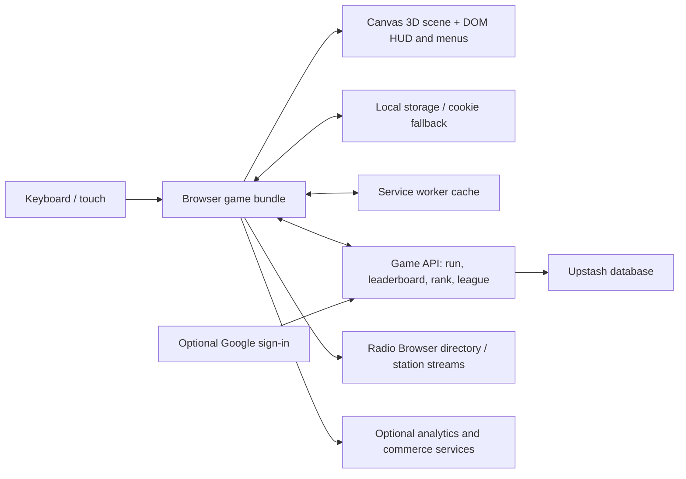

# Danfo Run: gameplay and observable architecture

Research date: 6 October 2026. Target: [Danfo Run](https://danfo.horpey.dev/) (earlier pages and articles also call it *Lagos Run*).

## Method and confidence

I played two short runs in the live browser, inspected the desktop and 390 × 844 portrait interfaces, opened Route, Garage, Leaderboard, Oja, and Gist, reviewed the resources loaded by the browser, and read the live [Privacy Policy](https://danfo.horpey.dev/privacy.html) and [Terms](https://danfo.horpey.dev/terms.html). The two observed runs ended at about 512 m and 202 m. The first showed 19 coins, 0 passengers, and 0 close calls; the second showed 0 coins, 0 passengers, and 2 close calls. Neither included a successful passenger stop. Figures and offers below are a snapshot of the live game, not fixed rules.

**Evidence labels:** **Observed** means seen during play or in the live UI; **Disclosed** means stated by the game's own pages; **Inferred** means a plausible explanation of visible behavior or asset structure. The production source and backend code were not available to inspect. A hashed JavaScript bundle is visible, but its internal modules, scoring formula, simulation timing, collision math, and server validation algorithm remain unknown.

## 1. What the player does

The run starts directly from a 3D street scene with the danfo already visible. The bus moves forward without the player holding Gas. On desktop, arrow keys steer between lanes, Up accelerates, Down brakes, Space hops, H horns, P pauses, R changes radio, and M mutes. In portrait, the interface shows a steer gesture area, Brake and Gas pedals, and a large horn button. The tutorial says to slide left or right to steer and flick up to hop. **Observed.**

The visible objective is to avoid traffic and road hazards while stopping in a marked yellow kerb box. The tutorial says a stop loads passengers and drops off those whose destination has arrived, earning fares. The HUD shows the next named stop, remaining metres, seats out of 14, speed, score, multiplier, coins, a route progress strip, and contextual stop guidance. During the second run, guidance changed from “Stop ahead: keep right, brake in the box” to a distance warning. I did not complete a stop, so timing thresholds, fare amounts, boarding counts, and stop grades are **unverified**.

Score and currency are separate in the live UI. A run accumulates a score immediately; coins are collected and retained for the garage and shop. The result screen is a ticket showing score, coins, distance, passengers, close calls, and mission progress. It offers another run, a home return, the garage, leaders, and a score post. A crash ended each test run, but two runs are insufficient to establish the exact damage rule. **Observed.**

### Why the loop holds attention

The game layers several time scales over the same drive:

| Time scale | Visible system | Player effect |
|---|---|---|
| Seconds | Lane changes, traffic, pickups, near misses, score multiplier | Immediate steering and risk decisions |
| Tens of seconds | Named stops, yellow loading zones, passengers, route progress | A reason to slow down and choose the kerb lane |
| One run | Three missions, score, coins, result ticket | A measurable attempt with a clear recap |
| Many runs | Nine route stamps, best score, garage purchases, upgrades | Goals beyond surviving farther |
| Calendar | Day streak and daily road modifier | The same route can feel different by day |
| Social | Daily, weekly, all-time boards and a named score | Competition and a reason to replay |

The Route panel showed “Stop 1 of 9: Carry 9 passengers in one run,” followed by “Stay Fast ×1.5 for 12 s in one run.” The active mission panel showed three goals: carry 9 passengers, hold the multiplier for 12 seconds, and collect a plate of jollof. The nine stamps appear to be **progression objectives**, not nine geographic bus stops; that distinction matters when comparing them with Poda-Poda Run's stop list. **Observed.**

Gist listed daily modifiers: Market Tuesday increases crossings; Rainy Wednesday adds puddles, potholes and haze; Double Fare Thursday changes fares; Jollof Friday adds a pickup; Owambe Saturday gives party buses and double coins; Free Road Sunday lightens traffic; Go-slow Monday makes cars slow. These are announced before play and change game conditions rather than merely reskinning a screen. **Observed in Gist; individual modifiers were not independently playtested.**

## 2. Interaction and presentation

The title, garage, and leaderboard sit over a continuously rendered street and visible bus. Opening Garage moves the presentation toward the vehicle while a compact panel lists options. The 3D world remains the backdrop, which makes the menu feel like part of a game rather than a separate web page. Starting a run transitions straight to an offset chase view. **Observed.**

During play, the camera placed the bus toward the lower right at the beginning, leaving a long view of the lanes. It later followed the bus toward the centre after a lane change. This is a visual observation, not a measured camera transform or proof of the exact smoothing function. On portrait, the road and vehicle remained readable, but the visible field narrowed and the bus, stop guidance, horn, pedals, and progress strip used much of the available height. Camera and HUD trade-offs should be judged in actual mobile play, not copied from a desktop screenshot.

The environment uses low-poly road geometry and objects combined with illustrated textures. Browser-loaded image groups included facades, decals, pickups, road and roof textures, and bus images. Examples included shopfronts, window and church facades, oil slicks, puddles, road cracks, and asphalt. This supports the **inference** that textured detail is used to enrich relatively simple geometry. It does not prove the internal mesh structure or draw-call strategy.

The apprentice/conductor supplies contextual text: a market warning at the beginning and a stop reminder later. Radio, horn, engine and crash feedback are part of the immediate game experience. The site discloses that its own music is the default; live stations are discovered via Radio Browser and streamed directly to the player's browser. Custom local music is also available. **Observed and disclosed.**

In an [October 1 interview with the creator](https://www.themoveee.com/magazine/the-berlin-based-nigerian-developer-behind-the-danfo-game-everyone-is-playing), Opeyemi Adeniran said that live Lagos radio solved a production problem: he could not record a full local soundscape from Berlin. He also said the web release made it easier to reach players and change the game quickly in response to feedback. He cited interface cleanup, button placement, and sizing among that feedback. This is first-hand design context, not evidence of the current internal code. The live game had gained paid cosmetic and advertising features by the October 6 test, so the interview's earlier discussion of future monetization is dated.

## 3. Progression, economy, and social systems

Garage has Paint, Sticker, Horn, and Upgrades tabs. Paint options cost coins or depend on a calendar/streak reward. Stickers include presets plus a custom rear slogan. Horns have distinct sounds and prices. Upgrades extend the duration of pickups such as Magnet, Shield, Danfo Pass, Super Hop, and ×2 Score. The current bus is previewed in the scene while the player browses. **Observed.**

Oja offers coin-priced consumables such as a spare tyre and a shield/magnet start, plus optional paid cosmetic packs. The panel describes these paid items as offering no gameplay advantage. The site also displays bookable business boards in the world and advertises them through Gist. Its current privacy page describes those boards and artist bookings as separate business systems. These are part of Danfo Run's live product architecture, but their monetization model need not be copied to Poda-Poda Run. **Observed and disclosed.**

The leaderboard displayed Everyone and Motor Parks sections, plus Today, This week and All time filters. The first screen showed real ranked scores and a driver count. The result screen allowed entry of a public driver name after the run. Google sign-in is optional for playing and is promoted for cross-device progress; I did not sign in or post a score. **Observed.**

## 4. Observable software architecture

The diagram combines observed browser structure and the site's disclosures; it is **not** a recovered source design. The live page loads one hashed main JavaScript module bundle and supporting chunks, self-hosted fonts, image sprites, and a canvas-backed game with DOM controls and menus. A hashed bundle is evidence of a build pipeline, but does not identify its source framework, bundler, module layout, or Three.js version. The pasted research calls it Three.js; I did not independently verify the renderer library from the available public source. **Observed, with limits.**

The browser requested endpoints under `/api/run`, `/api/leaderboard`, `/api/rank`, `/api/league`, `/api/ads`, `/api/artists`, and `/api/pay`. An endpoint's presence identifies a client/server boundary, not its exact request body or internal implementation. The game's [Privacy Policy](https://danfo.horpey.dev/privacy.html) says Vercel hosts the game and leaderboard server, Upstash holds leaderboard and account data, progress lives primarily in local storage with a first-party cookie fallback, and a service worker caches the game for offline use. It also says a run transmits a score, distance and duration so the server can reject impossible scores. It does **not** say the server recomputes the official score from a full event log. **Observed and disclosed.**

The same policy says optional Google sign-in syncs best scores, coins, paints, boosts, missions, route stamps, streaks, settings and counters across devices. Analytics loads only after consent, according to the policy. The policy describes external radio streams and a Radio Browser station directory. Live Oja and the current policy also show optional purchases, road-board bookings and artist music bookings, with Bachs named as the payment processor and Cloudflare as the artist-song file host. These are business and account systems around the driving core. **Disclosed; no payment or sign-in flow was performed.**

### What cannot be concluded from this research

- Whether traffic and environment objects are pooled, recreated, or streamed in chunks.
- The precise camera update, collision boxes, spawn probabilities, acceleration, braking, stop acceptance window, or score formula.
- Whether the bundled renderer is Three.js, a custom WebGL layer, or another engine.
- The exact server schema, anti-cheat checks, authentication protocol, and leaderboard aggregation code.
- Any claim that a public score is fully cheat-proof. The policy only promises basic impossible-run rejection and moderation.

These questions would require source access, developer documentation, or a controlled instrumented test. This study used the browser interface; it did not modify the game, construct direct score requests, sign in, or purchase anything. The game's [Terms](https://danfo.horpey.dev/terms.html) restrict score manipulation and direct submissions.

## 5. Comparison with Poda-Poda Run

| Danfo Run finding | Current Poda-Poda Run evidence | Research implication |
|---|---|---|
| Bus stops vary the driving rhythm | `index.html` has yellow zones, dwell, boarding, drop-off, a fare and a binary perfect bonus | Preserve the transport loop; test stop readability and add measured stop accuracy only after playtesting |
| Mission and route stamps span runs | `index.html` has no mission or route-stamp state | Define a small mission set using existing events; keep route completion distinct from mission progression |
| Score and coins are distinct | Poda uses `S.cash` as the best-run measure; coins add directly to cash | Decide whether earnings and competitive score should diverge before building a leaderboard |
| Bus visibly persists across menus | Poda's start screen renders a Freetown town orbit; the player bus appears in play | Test a bus-visible title/garage presentation with the existing `vehicles.js` model |
| Garage uses a live 3D bus preview | Poda has schemes and slogans and a developer `?garage` view, but no player garage | Reuse `makePoda` options and existing model viewer ideas; design persistence separately |
| Daily modifiers change play | Poda has district visuals and traffic generation but no daily rule layer | Consider later, after the base route has a reliable finish and replay score |
| Server receives run data | Poda is currently static frontend code with local best only | A public board requires an API and score rules; the Danfo site does not establish that server recomputation is necessary or sufficient |
| Off-centre chase view and contextual HUD | Poda already widens FOV under gas and shakes on impact; camera follows lane position without a designed lag state | Compare camera variants and stop visibility on desktop and portrait before adopting an offset |
| Strong local identity from layered detail | Poda has west/east district plug-ins, Freetown scenery, vehicles, Krio text, and audio | Invest in recognition and interaction in each district, not a wholesale renderer rewrite |

Current Poda-Poda Run implementation: [`index.html`](../../index.html), [`vehicles.js`](../../vehicles.js), [`people.js`](../../people.js), [`districts-west.js`](../../districts-west.js), [`districts-east.js`](../../districts-east.js). The local [`west-notes.md`](../../research/west-notes.md) contains an old warning about Lumley's route position; the present `DATA.route` has Lumley before Lumley Beach Road, so that warning is stale.

## 6. Research-led sequence for Poda-Poda Run

1. **Decide the run contract.** Is Goderich → FBC a completed shift, an endless loop, or both? The current route wraps after FBC. This determines result design, mission targets and fair comparisons.
2. **Playtest the first stop and portrait controls.** Record whether players can see the zone, change to the kerb lane, brake in time, and understand why a stop was missed. This is the highest-risk interaction in the transport fantasy.
3. **Separate measures only if useful.** Keep fare/cash as transport earnings; consider a skill score based on stops, passengers, safe driving and route completion. Avoid adding points whose behavior is hard to explain.
4. **Build a small mission layer from existing events.** Examples: passengers delivered, perfect stops, reach a named district, complete a run without a collision. The event hooks already exist in the game loop.
5. **Prototype a bus-visible title and garage.** The 3D asset is already there; begin with paint/slogan choices and local persistence rather than a large upgrade economy.
6. **Add a public board only after score rules settle.** Keep account optional if that matches the desired player experience. Define a run record and server validation appropriate to the chosen game mode.

## Sources

- Live game and ordinary browser play: https://danfo.horpey.dev/
- Current first-party privacy and architecture disclosure: https://danfo.horpey.dev/privacy.html
- Current first-party terms and fair-play limits: https://danfo.horpey.dev/terms.html
- First-hand creator interview on radio, browser distribution and iteration: https://www.themoveee.com/magazine/the-berlin-based-nigerian-developer-behind-the-danfo-game-everyone-is-playing
- Poda-Poda Run local source and research files linked above.
